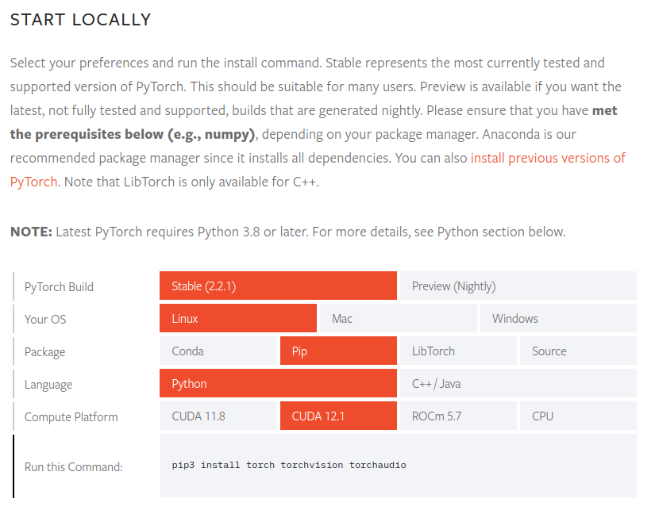

# YOLOProjects

This project is meant to give a concise overview of the YOLO models family. Following a series of projects, we'll go through YOLO's development history, technical breakthroughs, use cases, and practical projects. Although I plan to use several packages, our main focus will be the Ultralytics package and its API.

# Packages Installation

Although a *requirements.txt* is provided, it's recommended to install all packages individually due to the use of PyTorch and possible system requirements to use CUDA.

You can begin by creating a Python virtual environment using the tool of your choice:

```shell
# Using Python's virtualenv
python -m venv .venv
```

Install the common packages using pip.

```shell
pip install notebook opencv-python pytube imageio 
```

After that, proceed to install [PyTorch using the official documentation page](https://pytorch.org/get-started/locally/).



Next, proceed to install the [Ultralytics package](https://docs.ultralytics.com/quickstart/).

```shell
pip install ultralytics
```